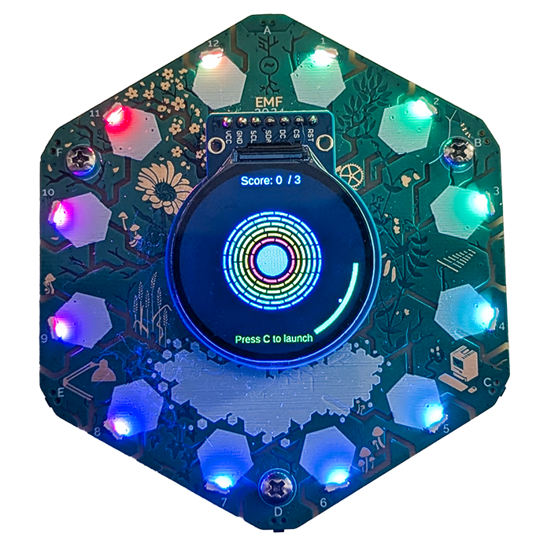

# Tildagen Arc Pong

A circular breakout game for the [Tildagon badge](https://tildagon.badge.emfcamp.org/). Your paddle is an arc on the outer rim — tilt the badge to steer it round, smash concentric rings of bricks, don't let the ball escape.



Generated in one shot with [Tildagen](https://github.com/webboggles/tildagen).

## Features

- **Polar playfield** &mdash; paddle travels the circumference, bricks are concentric arc segments
- **IMU steering** &mdash; yaw the badge to swing the paddle (falls back to LEFT/RIGHT buttons if no IMU)
- **Spin physics** &mdash; hitting the edge of the paddle adds tangential spin to the ball
- **Solid inner core** &mdash; the ball bounces off the central disc as well as the bricks
- **Lives, score, win/lose states** &mdash; 3 lives, press CONFIRM to launch and to restart

## Controls

| Button | Action |
|--------|--------|
| Tilt (yaw) | Move paddle round the rim |
| LEFT / RIGHT | Move paddle (fallback if no IMU) |
| CONFIRM | Launch ball / restart after game over |
| CANCEL | Exit to badge menu |

## Install

### From the app store

Search **Tildagen Arc Pong** in the Tildagon app store once it appears (~15 min after release).

### Manual install via mpremote

```
mpremote mkdir apps/tildagen_arc_pong
mpremote cp app.py :apps/tildagen_arc_pong/app.py
```

Hold the **reboop** button for 2 seconds to restart, then select Tildagen Arc Pong from the Games menu.

### One-click install via Tildagen

If you have [Tildagen](https://github.com/webboggles/tildagen) set up, paste this prompt into it to regenerate an equivalent app, then **Push to Badge**:

> Create a single player pong but with the bat traveling the outer circumference of the screen. Use IMU for control. Ball bounces off arc blocks in the middle of the screen, concentric rings of colour that you have to destroy.

## Licence

CC-BY-NC-4.0 &mdash; free to use and modify for non-commercial purposes with attribution.

Built by [webboggles](https://github.com/webboggles) / [weborder.uk](https://weborder.uk) using [Tildagen](https://github.com/webboggles/tildagen).
